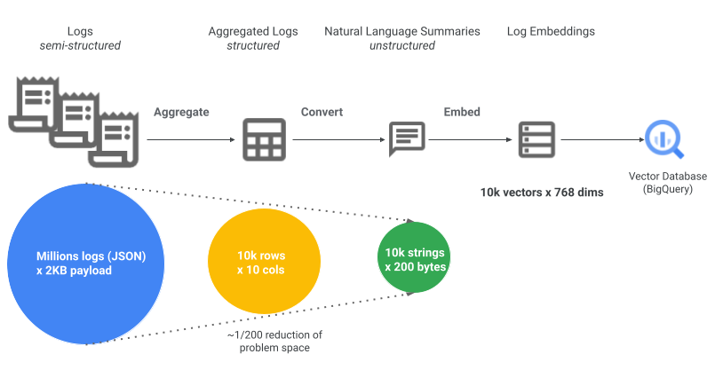

# Dataform repo for BigQuery vector search over logs

## Overview

This Dataform repo automates the post-processing of Cloud Audit Logs in BigQuery to help you run [vector search](https://cloud.google.com/bigquery/docs/vector-search-intro), that is semantic similiarty search, over those logs. Vector search can be used to detect and investigate anomalies in the logs, which is useful in several use cases ranging from application troubleshooting to developer operations, to network forensics and security operations, to business insights and more. You can analyze the vector search results directly or leverage them as part of Retrieval Augmented Generation (RAG)-based Large Language Model (LLM) applications.

As shown in the diagram below, this Dataform repo deploys a data pipeline to continuously **aggregate** logs, **convert** them to natural language summary texts, and **generate vector embeddings** which enable subsequent vector searches. While this example demonstrates how to summarize Cloud Audit Logs, you can modify this Dataform repo to target other types of logs like application logs, network logs, or system logs.

Dataform is a service and an open-source data modeling framework to manage ELT process for your data in BigQuery, including scheduled workflows to continuously and incrementally update your datasets. To learn more about Dataform, see [Overview of Dataform](https://cloud.google.com/dataform/docs/overview).

## Prerequisite

Before you begin, you must have a linked BigQuery dataset for your Log Analytics-enabled log bucket where your Cloud Audit Logs are stored. The linked BigQuery dataset is the source read-only dataset for the data pipeline built by this Dataform repo. The linked BigQuery dataset may be in a different Google Cloud project than the project that you will use to host your Dataform repository and the target BigQuery dataset with processed logs.

If you haven't already, make sure to:

1. Determine the log bucket where your Cloud Audit Logs are stored. Unless you have configured a custom log sink and log bucket, this is typically the `_Required` log bucket which contains your project's Admin Activity audit logs, or the `_Default` log bucket which contains your project's Data Admin audit logs.
1. [Upgrade your log bucket to use Log Analytics](https://cloud.google.com/logging/docs/buckets#upgrade-bucket).
1. [Create a linked BigQuery dataset](https://cloud.google.com/logging/docs/buckets#link-bq-dataset).
1. [Enable the BigQuery, BigQuery Connection, and Vertex AI APIs](https://console.cloud.google.com/flows/enableapi?apiid=bigquery.googleapis.com,bigqueryconnection.googleapis.com,aiplatform.googleapis.com) in the project that will host your Dataform repository and target BigQuery dataset.

## Required roles

To use this project, you need to the following IAM roles:

- `Dataform Admin` (`roles/dataform.admin`) in order to create a new Dataform repository unless there's a repository already created for you. Given the broad access granted by this role, you may ask an administrator to create a repository for you.
- `Dataform Editor` (`roles/dataform.editor`) in order to create a development workspace, make code changes, and manually trigger the execution of the SQL workflow.
- `BigQuery Connection Admin` (`roles/bigquery.connectionAdmin`) in order to create a Cloud resource connection required to use the remote model, that is the hosted Vertex AI embedding model.

Dataform will execute actions and workflows defined in this repository using the default Dataform service account, unless you specify a custom service account in the Dataform repository settings.  You need to grant the Dataform service account the following IAM roles to read the source dataset, and to create the target dataset, tables, models, and (vector) index.

- `BigQuery Data Editor` (`roles/bigquery.dataEditor`) and `BigQuery Job User` (`roles/bigquery.user`) on the project hosting your Dataform repository in order to create BigQuery dataset, tables, models, and (vector) indexes, and to run BigQuery jobs. Follow the steps documented [here](https://cloud.google.com/dataform/docs/required-access#grant-required-roles).
- `BigQuery Data Viewer` (`roles/bigquery.dataViewer`) on your source BigQuery linked dataset where your Cloud Audit Logs are stored. Follow the steps documented [here](https://cloud.google.com/bigquery/docs/control-access-to-resources-iam#grant_access_to_a_dataset) to grant dataset access.
- `BigQuery Connection User` (`roles/bigquery.connectionUser`) on your BigQuery Cloud resource connection (to be created in the following section) to connect to the Vertex AI embedding model, and generate text embeddings. Follow the steps documented [here](https://cloud.google.com/bigquery/docs/create-cloud-resource-connection#share_connections) to grant connection access.

Additionally, if using a custom service account in Dataform, you need to grant the default Dataform service account the following role:

- `Service Account Token Creator` (`roles/iam.serviceAccountTokenCreator`) on the custom service account so the default Dataform service account can impersonate it. Follow the steps documented [here](https://cloud.google.com/dataform/docs/required-access#grant_token_creation_access_to_a_custom_service_account).

## Getting started

To use this Dataform project:

1. Copy this folder into your own Git repository hosted by GitHub, GitLab, BitBucket or Azure DevOps.

1. If you don't have one already, create a Dataform repository using Google Cloud Console following these [instructions](https://cloud.google.com/dataform/docs/create-repository).

1. Link your newly created Datatorm repository to your Git repository following these [instructions](https://cloud.google.com/dataform/docs/connect-repository).

1. To enable BigQuery to connect to Vertex AI embedding models, create a Cloud resource connection following these [instructions](https://cloud.google.com/bigquery/docs/vector-index-text-search-tutorial#create_a_connection). Make sure to specify the same location as the intended location of your BigQuery target dataset (e.g. 'US'). You will use the same connection name (e.g. 'vertexai-models') when configuring the Dataform compilation variable `vertexai_connection` later on. Take note of the connection's service account ID to be used in subsequent step.

1. Grant the following permissions around the Cloud resource connection:
    1. Grant the connection's service account the IAM role `Vertex AI User` (`roles/aiplatform.user`) to access the Vertex AI service, following these [instructions](https://cloud.google.com/bigquery/docs/vector-index-text-search-tutorial#grant_the_service_account_access)
    2. Grant the Dataform service account the IAM role `BigQuery Connection User` (`roles/bigquery.connectionUser`) to use the Cloud resource connection, following these [instructions](https://cloud.google.com/bigquery/docs/create-cloud-resource-connection#share_connections).

Now are you ready to execute the Dataform SQL workflow. You can either:
- [Manually trigger the execution](#execute-workflow-manually) of the SQL workflow (useful for development and testing purposes), or,
- [Schedule recurrent executions](#schedule-executions-with-workflow-configurations) to run periodically by Dataform service (use this for QA, staging or production environments). This will keep your target dataset up-to-date with latest logs from your source dataset.

### Execute workflow manually
Use this for development and testing.

1. Navigate to [Dataform page](https://console.cloud.google.com/bigquery/dataform)

1. Select your Dataform repository, then select 'Development Workspaces' tab.

1. Create a development workspace in your Dataform repository following these [instructions](https://cloud.google.com/dataform/docs/create-workspace#create-workspace).

1. Open `dataform.json` file in your development workspace IDE. This file contains the configuration for this Dataform project, further documented in the [Configuration](#configuration) section below.

1. Edit `dataform.json` file with your own settings. In particular, you need to replace the following values:
    - Replace `[PROJECT_ID]` placeholder value with the ID of your Google Cloud project.
    - Replace `[CONNECTION_ID]` placeholder value with the name of the Cloud resource connection you created above (e.g. 'vertexai-models')
    - Replace `[LOGS_PROJECT_ID]` placeholder value with the ID of the Google Cloud Project where raw logs currently reside.
    - Replace `[LOGS_DATASET_ID]` placeholder value with the name of your source BigQuery dataset, that is the linked BigQuery dataset where raw logs are stored.

1. Manually run entire workflow, following these [instructions](https://cloud.google.com/dataform/docs/trigger-execution#manually_execute_all_actions_in_your_workflow). This will execute all actions including creating BigQuery tables, and dependancies including remote BigQuery model and persistent User-Defined Functions (UDF).

### Schedule executions with workflow configurations
Use this for QA, staging or production environments.

1. Navigate to [Dataform page](https://console.cloud.google.com/bigquery/dataform)

1. Select your Dataform repository, then select 'Releases & Scheduling' tab.

1. Create a release configuration following these [instructions](https://cloud.google.com/dataform/docs/release-configurations#create-release-configuration). In a release configuration, you set (or override) your Dataform settings and set a schedule (e.g. daily)to compile your workflow code. In particular, you need to set:
    - `Google Cloud Project ID` (under compliation overrides) to the target Google Cloud project ID hosting your Dataform repository. This will override `defaultDatabase` setting in `dataform.json`.
    - `vertexai_connection` key (under compliation variables) with the value being the name of the Cloud resource connection you create above (e.g. 'vertexai-models')
    - `logs_export_project` key (under compliation variables) with the value being the ID of the Google Cloud Project where raw logs currently reside.
    - `logs_export_dataset` key (under compliation variables) with the value being the name of your source BigQuery dataset, that is the linked BigQuery dataset where raw logs are stored.

    You can optionally override other Dataform settings which are documented in the [Configuration](#configuration) section below.

1. Create a workflow configuration following these [instructions](https://cloud.google.com/dataform/docs/workflow-configurations#create-workflow-configuration). In the workflow configuration, you select the release configuration you created above, and set a schedule  (e.g. daily) to execute the entire SQL workflow.

## Configuration

The `dataform.json` file contains the configuration for this Dataform repository. It includes:

* **defaultDatabase:** Specifies the target Google Cloud project ID.
* **defaultSchema:** Defines the target BigQuery dataset.
* **defaultLocation:** Sets the location of the target BigQuery dataset e.g. 'US'.
* **vars:** Contains compliation variables used throughout the project, including:
    * **logs_export_project:** Google Cloud project ID with source BigQuery dataset with raw logs.
    * **logs_export_dataset:** Source BigQuery dataset with raw logs.
    * **summary_lookback_days:** Lookback window for processing historical raw logs into summary tables.
    * **admin_activity_only:** Specifies Whether to only include admin activity in logs, or all audit logs.
    * **vertexai_connection**: The cloud resource connection name to use for the remote Vertex AI model.
    * **text_embedding_model:** The text embedding model to use to generate vector embeddings e.g. 'text-embedding-gecko@003'.

## Contributing

Contributions are welcome! Please open an issue or submit a pull request if you have any suggestions or improvements.

