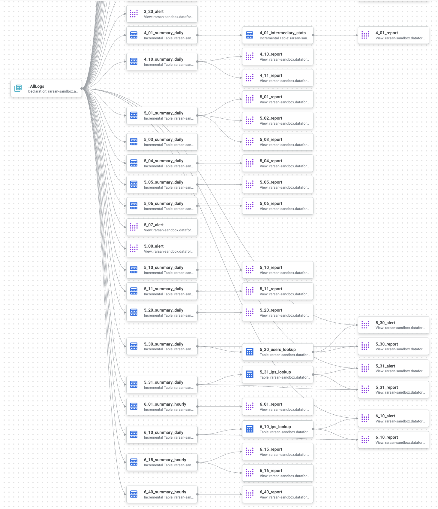

# Dataform repo for CSA

## Overview

This Dataform repo is provided to automate deployment of all CSA queries and underlying tables in BigQuery, while optimizing for query run-time performance and cost (data volume scanned). This Dataform project is targetted for customers using CSA queries for Log Analytics which is powered by BigQuery. Dataform is a service and an open-source data modeling framework to manage ELT process for your data. This particular Dataform project builds:

- Summary tables incremented on a daily or hourly basis.
- Lookup tables refreshed on daily or hourly basis (e.g. IP addresses with first and last seen).
- Intermediary stats tables incremented on a daily basis (e.g. activity count average and stddev per user over a rolling window).
- Report views for daily reporting based on summary tables, plus stats tables when applicable.
- Alert queries for continuous alerting based on raw logs, plus lookup tables when applicable.
- Workflow configurations to update above summary tables, lookups and stats tables on a daily, hourly or your own custom schedule.

To learn more about Dataform, see [Overview of Dataform](https://cloud.google.com/dataform/docs/overview).

## Configuration

Configuration is controlled by values in [`dataform.json`](./dataform.json) file, in particular the destination Google Cloud project (`defaultDatabase`), the destination BigQuery dataset (`defaultSchema`) and its location (`defaultLocation`), and the variables listed in following section.

### Variables

| Variable | Description | Default value |
|---|---|---|
| `logs_export_project` | Project where logs are exported | |
| `logs_export_dataset` | BigQuery dataset where logs are exported. Enter your BigQuery linked dataset of your Log Analytics-enabled log bucket | |
| `raw_lookback_days` | Lookback window for reports from raw data in number of days | 90 |
| `summary_lookback_days` | Lookback window for creating summary tables from raw data in number of days | 90 |
| `report_interval_days` | Report time interval in number of days | 30 |
| `alert_interval_minutes` | Alert time interval in number of minutes | 60 |

## Datasets

### Source datasets

- `definitions/sources/log_source.sqlx` or `_AllLogs`: Default view of all logs in the BigQuery linked dataset of your Log Analytics-enabled log bucket. The full view ID used in the source declaration is `<logs_export_project>.<logs_export_dataset>._AllLogs`.

### Destination datasets
- `defintions/summary/<CSA_ID>_summary_[hourly|daily].sqlx`: Summary table for a given CSA ID#. Depending on the use case, summary table are incremented hourly (e.g. network logs) or daily (e.g. admin activity logs). While configurable, the default summarization interval depends on the log volume to be summarized and the desired reporting granularity. For example, VPC flow logs are voluminous and typically reported on hourly basis for tracking traffic volume or number of connections, e.g. `6_01_summary_hourly.sqlx` and `6_15_summary_hourly.sqlx`.
- `defintions/summary/<CSA_ID>_<entity>_lookup.sqlx`: Lookup table for a given CSA ID# and a particular entity such as IP addresses (`ips`) or users (`users`). Lookup tables track historical entity information such as IP addresses and when they were first time and last time seen, to be used for threat reporting and alerting. For example, `5_31_ips_lookups` track all IP addresses that have accessed any Cloud Storage object. This lookup `5_31_ips_lookups` is used by `5_31_alert` to flag any new connection from a never-before-seen IP address to a sensitive Cloud Storage object.
- `definitions/reports/<CSA_ID>_report.sqlx`: Report view for a given CSA ID# based on corresponding summary table, plus lookup table(s) when applicable. This applies to CSA auditing, investigation and reporting use cases.
- `definitions/alerts/<CSA_ID>_alert.sqlx`: Alert view for a given CSA ID# based on raw logs, plus lookup table(s) when applicable. This applies to CSA threat detections use cases.

### Dependency tree

The following shows a section of a compiled graph with all CSA tables and views in the target BigQuery dataset along with their dependencies all the way upstream to the source, that is `_AllLogs` view from the source BigQuery linked dataset.

## Usage with Dataform CLI

### Install Dataform CLI

* In your favorite terminal, run the following command to install Dataform CLI:

        npm i -g @dataform/cli@^2.3.2

### Update Dataform

* Run the following command to CD into `dataform` project directory and update the Dataform framework:

        cd dataform
        npm i @dataform/core@^2.3.2

### Create a credentials file

To connect to your BigQuery warehouse and deploy datasets, Dataform requires a credentials file.

1. Run the following command:

        dataform init-creds bigquery

2. Follow the `init-creds` prompts that walks you through creating the credentials file `.df-credentials.json`

Warning: Do not accidentally commit that file to your repository. The repo `.gitignore` is configured to ignore the credentials file `.df-credentials.json` to help protect your access credentials.

### Override dataform.json

You specify your source and target BigQuery datasets using `dataform.json` file. You can also override any other configuration variables defined in [variables section](#variables).

1. Open `dataform.json` using your favorite editor.
2. Replace `[PROJECT_ID]` placeholder value for `defaultDatabase` with the ID of your Google Cloud Project containing your target BigQuery dataset.
3. Replace `csa` default value for `defaultSchema` with the name of your target BigQuery dataset.
4. Replace `[LOGS_PROJECT_ID]` placeholder value for `logs_export_project` variable, with the ID of the Google Cloud Project where raw logs currently reside.
5. Replace `[LOGS_DATASET_ID]` placeholder value for `logs_export_dataset` variable, with the name of your source BigQuery dataset, i.e. the BigQuery linked dataset where raw logs are stored.

### Compile Dataform code

* To compile all .SQLX code without deploying datasets, run the following command

        dataform compile

For more details on common `dataform compile` command line options, refer to [View compilation output](https://cloud.google.com/dataform/docs/use-dataform-cli#view_compilation_output)

### Execute Dataform code

* To execute all .SQLX code and deploy or update all datasets in your target BigQuery dataset, run the following command:

        dataform run

For more details on common `dataform run` command line options, refer to [Execute code](https://cloud.google.com/dataform/docs/use-dataform-cli#execute_code)
